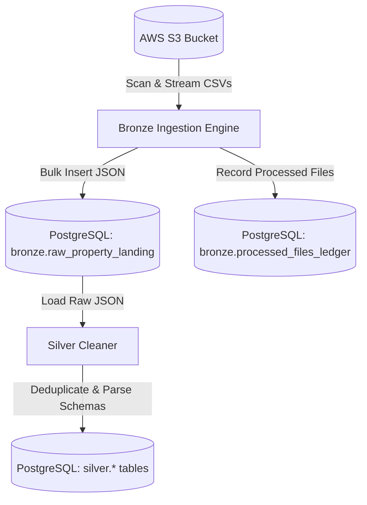

# 🏛️ NexusProperty Data Platform

NexusProperty is a robust data warehousing and processing pipeline designed to ingest, process, and model property housing datasets. It features a multi-layered data lakehouse architecture (Bronze, Silver, Gold layers) that extracts raw city assets and metadata from cloud storage (Amazon S3) and loads them into a managed data warehouse (Amazon RDS PostgreSQL).

---

## 🏗️ Architecture Overview

The platform implements a multi-layered data pipeline (Bronze and Silver layers):



### 1. Ingestion Engine ([bronze_layer.py](file:///c:/Users/Ayush/Git%20Repo/NexusProperty/backend/app/bronze_layer.py))
- **Scanning**: Scans specified folders inside the S3 bucket using prefixes for city data and metadata.
- **Streaming**: Fetches files in chunks (default 2,000–5,000 rows) using `pandas` to keep the memory footprint low.
- **Ledger Tracking**: Uses `bronze.processed_files_ledger` to keep records of successfully processed files, preventing double ingestion.
- **Landing Storage**: Converts each row into a JSON string and saves it directly to `bronze.raw_property_landing` to handle changing schemas dynamically.

### 2. Clean & Transform Layer ([silver_cleaner.py](file:///c:/Users/Ayush/Git%20Repo/NexusProperty/backend/app/silver_cleaner.py))
- **Parsing**: Extracts the raw JSON objects from `bronze.raw_property_landing`.
- **Validation**: Performs type casting, handles missing data, standardizes keys, and validates properties.
- **Deduplication**: Deduplicates data before writing to the target `silver` schema tables in PostgreSQL.

### 3. Database Layer ([database.py](file:///c:/Users/Ayush/Git%20Repo/NexusProperty/backend/app/database.py))
- Uses SQLAlchemy to manage connections to an AWS RDS PostgreSQL database.
- Implements connection pooling (`pool_pre_ping=True`) for production resilience.


---

## ⚙️ Configuration & Environment Setup

Create a `.env` file in the root directory of the project (this file is excluded from git via [.gitignore](file:///c:/Users/Ayush/Git%20Repo/NexusProperty/.gitignore)):

```env
# AWS Credentials
AWS_ACCESS_KEY_ID=your_access_key
AWS_SECRET_ACCESS_KEY=your_secret_key
AWS_DEFAULT_REGION=ap-south-1
Bucket=your-s3-bucket-name

# AWS S3 Folder Prefixes
CITY_DATA_PREFIX=Housing-By-City-CSV
METADATA_PREFIX=Housing-Detail-CSV

# PostgreSQL RDS Connection
RDS_USERNAME=postgres
RDS_PASSWORD=your_rds_password
RDS_ENDPOINT=your-rds-endpoint.amazonaws.com
RDS_PORT=5432
RDS_DB_NAME=nexus_dw
```

---

## 🚀 How to Run

### Option 1: Run Ingestion Locally (Recommended)

1. Navigate to the backend directory:
   ```bash
   cd backend
   ```
2. Install dependencies:
   ```bash
   pip install -r requirements.txt
   ```
3. Run the bronze ingestion pipeline:
   ```bash
   python -m app.bronze_layer
   ```

### Option 2: Docker Compose

Start the backend container in the background:
```bash
docker-compose up --build -d
```
> [!NOTE]
> The current [Dockerfile](file:///c:/Users/Ayush/Git%20Repo/NexusProperty/backend/Dockerfile) is configured to start a FastAPI server (`app.main:app`). Ensure a `main.py` entrypoint is created inside `backend/app/` if you plan to run the REST API interface through Docker.

---

## 📂 Project Structure

```
NexusProperty/
├── .env                  # Local secrets and config (gitignored)
├── .gitignore            # Git exclusions configuration
├── docker-compose.yml    # Docker services config
├── backend/
│   ├── Dockerfile        # Container recipe for Python backend
│   ├── requirement.txt   # Backend dependency list (singular)
│   ├── requirements.txt  # Backend dependency list (plural)
│   └── app/
│       ├── database.py   # Database connection pool and SessionLocal config
│       ├── bronze_layer.py # Bronze ingestion engine pipeline
│       └── silver_cleaner.py # Silver cleaner data transformation pipeline
└── frontend/
    └── src               # Client placeholder (for future UI development)
```
